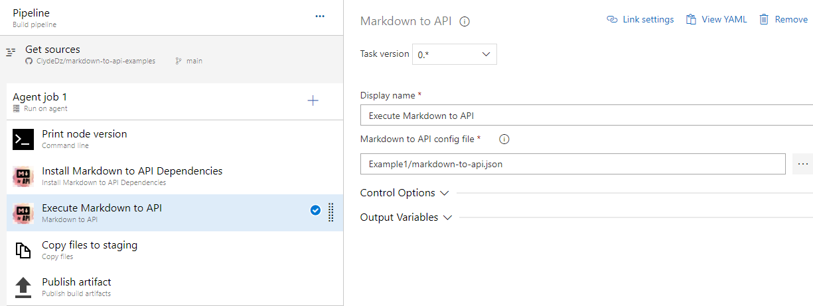

# Example 1  
Simple scenario showing a portfolio folder with Markdown files converted to JSON files using a simple config file.

## Details about the inputs to this process
- [Portfolio folder](portfolio/) contains sub-folders with Markdown files for each portfolio item. 
- FrontMatter is added to store portfolio item metadata. Below the FrontMatter is the portfolio item details written in Markdown.
- Both the metadata and the details will be available in the resultant JSON file. The contents in the details section will be available as Markdown and also as HTML. This allows your app to consume it in whichever way best suited. 
- **_You_** decide the schema of your FrontMatter metadata and what contents you put into the Markdown file. 
- See [this Markdown file](portfolio/speaking/2019/ted-virtual.md) as an example. 
- The [config file](markdown-to-api.json) is a simple JSON array that tells Markdown to API tool where to find the Markdown files and where to drop the processed output files. 
- Adding multiple objects to the JSON file just means that you need to generate JSON files for different "scenarios". Example: You might want to a JSON file with "all portfolio items" and another one with "books I've authored". 
- For this scenario, the screenshot below shows how the tasks have been added to the build pipeline. All you need to do is point the task to the config file and the rest of the magic will happen.   

- Check out the build steps [in Azure DevOps here](https://clydedsouza.visualstudio.com/Markdown%20to%20API/_build?definitionId=34).

## Details about the output of this process
- According to the config file, [this is the generated portfolio.json](https://clydedz.github.io/markdown-to-api-examples/Example1Output/portfolio.json) file.
- Individual Markdown files will be converted to JSON files following the same directory structure. For the Markdown file linked in the section above, [this is the JSON](https://clydedz.github.io/markdown-to-api-examples/Example1Output/speaking/2019/ted-virtual.json) output.
- If you'd like to browse through all the output files, check it out on `gh-pages` branch in GitHub. [Here's the direct link](https://github.com/ClydeDz/markdown-to-api-examples/tree/gh-pages/Example1Output).

